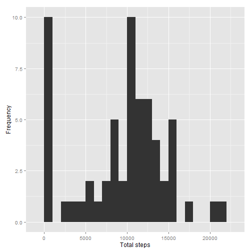
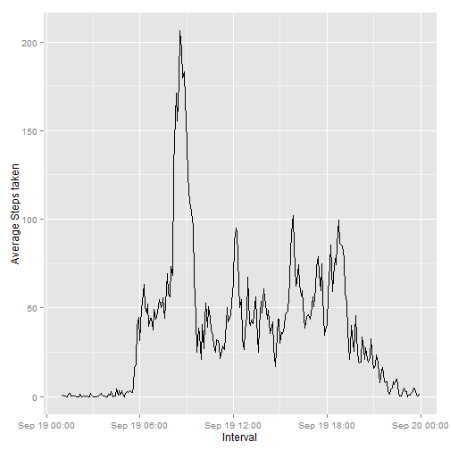
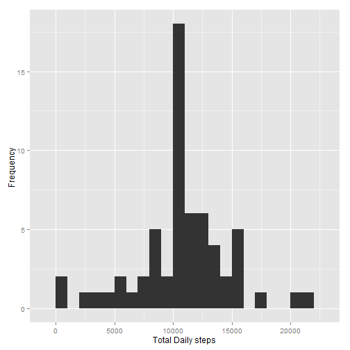
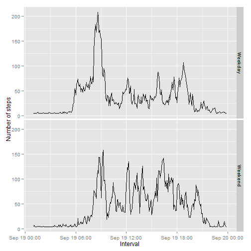

This is an R Markdown document. Markdown is a simple formatting syntax for authoring HTML, PDF, and MS Word documents. For more details on using R Markdown see <http://rmarkdown.rstudio.com>.

When you click the **Knit** button a document will be generated that includes both content as well as the output of any embedded R code chunks within the document. You can embed an R code chunk like this:


Reproducible Research: Peer Assessment 1


```r
library(ggplot2)
library(Hmisc)
```

## Loading and preprocessing the data
Below section is for loading and preprocessing the data

Load the data (i.e. read.csv())


```r
setwd("C:/Users/sunil/Documents/R-data/RepData_PeerAssessment1")
if(!file.exists('activity.csv')){
    unzip('activity.zip')
}
activityDS <- read.csv('activity.csv')
```

Process/transform the data (if necessary) into a format suitable for your analysis

```r
activityDS$interval <- strptime(gsub("([0-9]{1,2})([0-9]{2})", "\\1:\\2", activityDS$interval), format='%H:%M')
```
## What is mean total number of steps taken per day?


```r
TotstepsByDay <- tapply(activityDS$steps, activityDS$date, sum, na.rm=TRUE)
```

Make a histogram of the total number of steps taken each day


```r
qplot(TotstepsByDay, xlab='Total steps', ylab='Frequency', binwidth=1000)
```

 
Calculate and report the mean and median total number of steps taken per day

```r
TotstepsByDayMean <- mean(TotstepsByDay)
TotstepsByDayMedian <- median(TotstepsByDay)
```
Mean: 9354.2295
Median: 10395

## What is the average daily activity pattern?

```r
averageStepsPerInt <- aggregate(x=list(avgSteps=activityDS$steps), by=data.frame(list(interval=activityDS$interval)), FUN=mean, na.rm=TRUE)
```

Make a time series plot


```r
ggplot(data=averageStepsPerInt, aes(x=interval, y=avgSteps)) +
    geom_line() +
    xlab("Interval") +
    ylab("Average Steps taken") 
```

 
Which 5-minute interval, on average across all the days in the dataset, contains the maximum number of steps?


```r
mostSteps <- which.max(averageStepsPerInt$avgSteps)
timeMostSteps <-  gsub("([0-9]{1,2})([0-9]{2})", "\\1:\\2", averageStepsPerInt[mostSteps,'interval'])
```
Most Steps at: 20:15-09-19 08:35:00
## Imputing missing values

Calculate and report the total number of missing values in the dataset

```r
TotalMissVals <- length(which(is.na(activityDS$steps)))
```

Number of missing values: 2304

Devise a strategy for filling in all of the missing values in the dataset.
Replace missing values with the mean value

Create a new dataset that is equal to the original dataset but with the missing data filled in.


```r
ImputedDS <- activityDS
ImputedDS$steps <- impute(activityDS$steps, fun=mean)
```
Make a histogram of the total number of steps taken each day


```r
ImpstepsByDay <- tapply(ImputedDS$steps, ImputedDS$date, sum)
qplot(ImpstepsByDay, xlab='Total Daily steps', ylab='Frequency ', binwidth=1000)
```

 
... and Calculate and report the mean and median total number of steps taken per day.


```r
ImpstepsByDayMean <- mean(ImpstepsByDay)
ImpstepsByDayMedian <- median(ImpstepsByDay)
```
Mean (Imputed): 1.0766 &times; 10<sup>4</sup>
Median (Imputed): 1.0766 &times; 10<sup>4</sup>

## Are there differences in activity patterns between weekdays and weekends?

Create a new factor variable in the dataset with two levels – “weekday” and “weekend” indicating whether a given date is a weekday or weekend day.


```r
ImputedDS$dateType <-  ifelse(as.POSIXlt(ImputedDS$date)$wday %in% c(0,6), 'Weekend', 'Weekday')
```
Make a panel plot containing a time series plot


```r
ImpAvgActDS <- aggregate(x=list(avgSteps=ImputedDS$steps), by=data.frame(list(interval=ImputedDS$interval, dtype=ImputedDS$dateType)), FUN=mean, na.rm=TRUE)

ggplot(ImpAvgActDS, aes(interval, avgSteps)) + 
    geom_line() + 
    facet_grid(dtype ~ .) +
    xlab("Interval") + 
    ylab("Number of steps")
```

 
